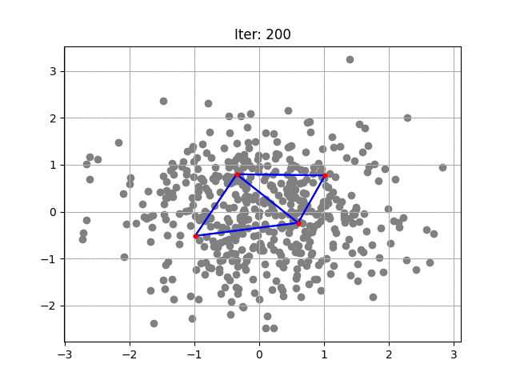

# Growing Neural Gas (GNG)
Based on [Paper][id]. As input for the fit method a two dimensional numpy array is required. The dimension can be arbitrary. Upon completation, the neurons coordinates, the activity flag (whether the neuron is used or not) and the adjacency matrix is return.

## Example:

    import numpy
    from pygng.gng import PyGng

    data = np.random.normal(size=(500,2))

 #   data = np.loadtxt("GSE156455_201106_early.200pcs.csv", delimiter=';', usecols=list(range(1,20)), skiprows=1)
 #   xmin = data.min(0)
 #   xmax = data.max(0)
 #   data = (data-xmin)/(xmax-xmin)
 #   data = data[:,:2]

    gng = PyGNG(maxNeurons=100, ageMax=25, iterMax=25000)
    gng.fit(data)

[id]: https://proceedings.neurips.cc/paper/1994/file/d56b9fc4b0f1be8871f5e1c40c0067e7-Paper.pdf  "Original Paper"