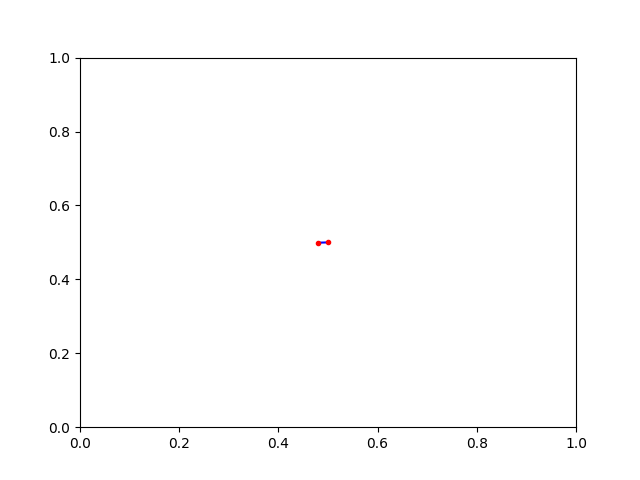

# Growing Neural Gas (GNG) and RRT
Based on this [Paper][id]. As input for the fit method a two dimensional numpy array is required. The dimension can be arbitrary. Upon completation, the neurons coordinates, the activity flag (whether the neuron is used or not) and the adjacency matrix is return. Only dependencies are Numpy and Matplotlib ( for plotting)

## Example GNG:

    import numpy
    from pygng.gng import PyGng

    data = np.random.normal(size=(500,2))
    gng = PyGNG(maxNeurons=100, ageMax=25, iterMax=25000)
    gng.fit(data)
    

## Example  RRT:

    x0 = np.asarray([[0.5,0.5]])

    p = PyRRT(maxIter=300, maxNodes=300, stepSize=0.02)
    p.run(x0, None, None)

[id]: https://proceedings.neurips.cc/paper/1994/file/d56b9fc4b0f1be8871f5e1c40c0067e7-Paper.pdf  "Original Paper"

Author: cmb87
License: MIT